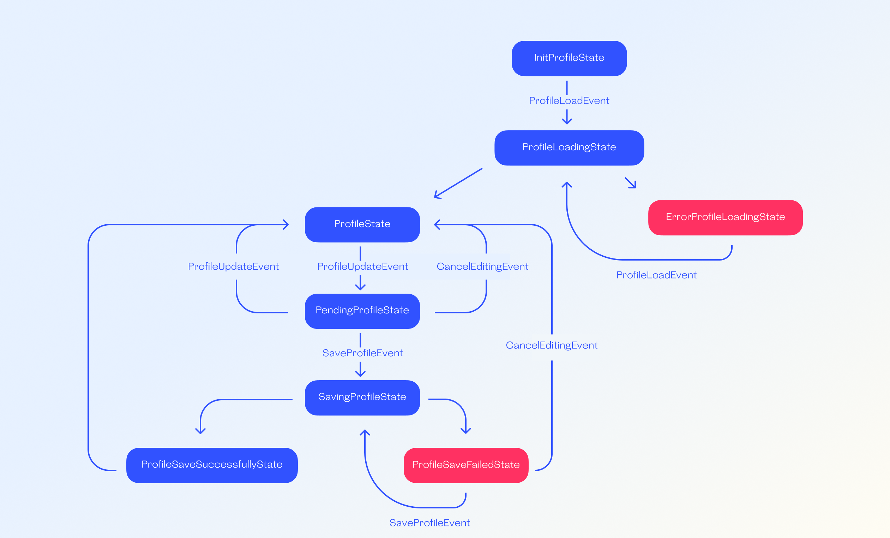

# Profile

Combining [Elementary](https://pub.dev/packages/elementary)
and [Bloc](https://pub.dev/packages/bloc).

This example shows how a profile can be filled out, saved on a server (a mock server), and, if
necessary, edited once filled out.

Bloc is used to track profile state (loaded, edited, saved). State interfaces are added to declare
which events are applicable to which states.

### A profile can be in one of the following states:

- **InitProfileState** - the profile is initialized with no actions yet taken.

- **ProfileLoadingState** - the profile is loading.

- **ErrorProfileLoadingState** - the profile failed to load from server.

- **ProfileState** - the profile is loaded successfully.

- **PendingProfileState** - the profile contains pending changes.

- **SavingProfileState** - the profile is being saved on server.

- **ProfileSavedSuccessfullyState** - the profile is successfully saved on server.

- **ProfileSaveFailedState** - the profile failed to be saved on server.

### Bloc diagram

[PersonalDataScreen](lib/features/profile/screens/personal_data_screen/personal_data_screen.dart), [PlaceResidenceScreen](lib/features/profile/screens/place_residence/place_residence_screen.dart), [InterestsScreen](lib/features/profile/screens/interests_screen/interests_screen.dart),
and [AboutMeScreen](lib/features/profile/screens/about_me_screen/about_me_screen.dart) contain presentation logic, therefore they are written
with [Elementary](https://pub.dev/packages/elementary). Thanks to that, we can separate presentation
from presentation logic and business logic.

[CancelButton](lib/features/profile/widgets/cancel_button/cancel_button.dart) is made into a
separate widget because it has its own logic regardless of where it is used.

Widget [FieldWithSuggestions](lib/features/profile/screens/place_residence/widgets/field_with_suggestions_widget/field_with_suggestions_widget.dart)
has extensive presentation logic and separate business logic that shows suggestions from the
repository when users enter the name of their city.

## Автотесты для профиля пользователя
Папка profile содержит каталоги созданных автотестов: script, integration_test, test_screen. В папке integration_test были созданы следующие каталоги: features (содержит функциональность профиля), step_definitions (содержит шаги пользователя в виде полей для реализации функциональности профиля, а также проверки этих полей). Также была создана логика написания автотестов (gherkin_suite.test.dart).Папка test_screen содержит локаторы для тестирования.

## Что нужно сделать:
Скачать архив с примером после лайвкодинга https://github.com/surfstudio/qa-summer-school-23/tree/e2e_example 
Если хотите можете пользоваться гитом через форк или приватный репозиторий.

## Реализованные задания:
1) Дописан сценарий который мы начали покрывать на лайвкодинге до конца. Название шагов в геркине менять можно, если это нужно для выполнения задания.
2) Кроме основного сценария написан и имплементирован сценарий на валидацию полей в случае неверного ввода.
3) Оптимизируйте использование методов ожидания (pump и pumpAndSettle).
4) Для шагов которые проверяют заполнение полей реализован механизм, который позволяет передавать данные между шагами внутри сценария чтобы была возможность не передавать данные в сценарии

Итоговый результат представляет собой ссылку на репозиторий на гитхабе.

